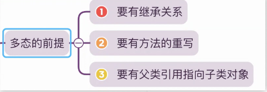
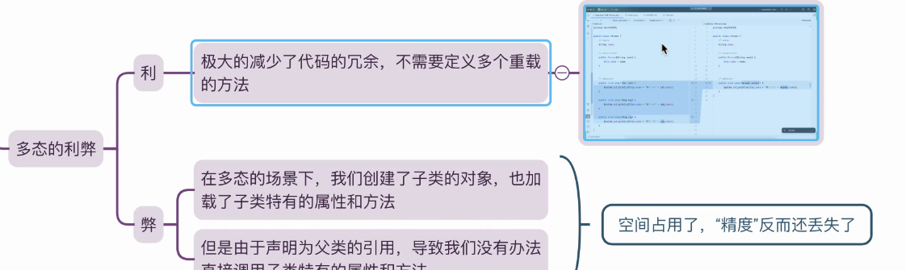
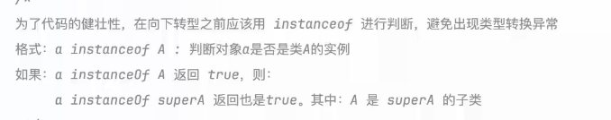

## OOAD分析设计
- 人养动物 猫狗 
- 每个人都有自己的孤独

注：无标准答案，多样性

每个人的设计不同，体现多样

## 多肽前提

 使用性
- 方法
- 不适合属性

## 多肽利弊

test2文件中含有多肽的使用性
## instanceof
 
 ## abstract 抽象
- Java 中的 abstract 关键字用于声明一个抽象类或者方法。

- 抽象类不能被实例化，它只能作为其他类的超类。

- 抽象类可以包含抽象方法和非抽象方法 。

- 抽象方法只有声明，没有实现，必须由子类实现。
## 抽象类的作用

 - 提供公共接口：定义一组子类都遵循的公共接口。
 - 实现多态：通过继承抽象类，可以实现多态。
  -代码复用：抽象类中可以包含一些共享的代码，子类可以重用这些代码。