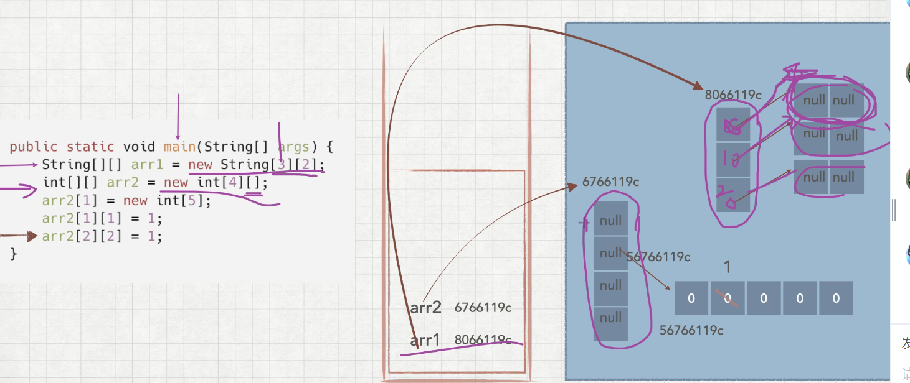

## 一 数组的进一步运用（利用数组编写自己的电话号码）
数组之间可以进行联系，数组套数组，数组的加减

## 二 99表的重温，
文件位置在：day241026/Table99,注重细节，慢慢，一步步对其解析。

## 三 数组空间分配
stack和heap

## 四 二维多维数组(引用数据类型)
静态：int arr[][]=new int[][]{1， 2， 3}，{2， 3， 4}}

动态初始化：1.String arr=new String[3][3]

2.double[][]arr4=new double[2][]

二维数组的长度取决于第一维：例如arr[3][4]长度为3

## 五，深入了解二维数组的空间分配，对应的类型
/*int[][] arr1=new int[4][];
System.out.println(arr1[1]);（数组是引用类型都是null）
输出结果null
*/
/*int[][] arr1=new int[4][3];
System.out.println(arr1[1][2]);
输出结果0，换成string则输出null，换成浮点则输出0.0，布尔型输出false即输出对应的基本单位
*/