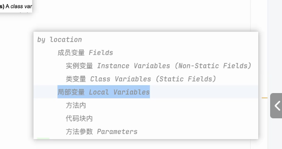
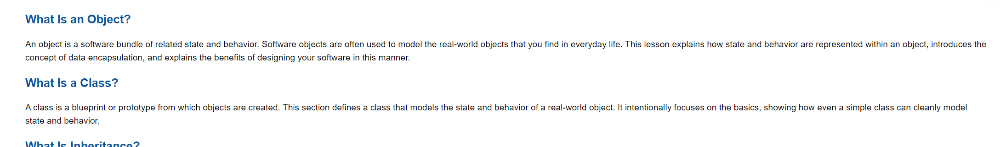
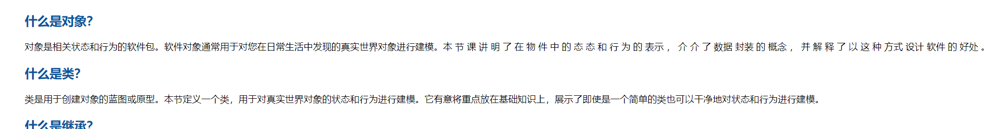

## 一：了解学习工具
https://pythontutor.com/render.html
https://visualgo.net/zh/sorting

## 二数组的冒泡排序
冒泡：一次比较两个元素，如果他们的顺序错误就把他们交换过来

冒泡流程：比较相邻的元素。如果第一个比第二个大，就交换他们两个。

对每一对相邻元素作同样的工作，从开始第一对到结尾的最后一对。这步做完后，最后的元素会是最大的数。

针对所有的元素重复以上的步骤，除了最后一个。

持续每次对越来越少的元素重复上面的步骤，直到没有任何一对数字需要比较。

n个元素进行n-1轮大循环，一个小循环中进行n-该次大循环次数的相邻两元素的比较
## 类与对象
1.对象：如何东西都能成为对象，对象有行为和状态

objectlocation：

成员变量：类里面方法之外
局部变量：方法之内