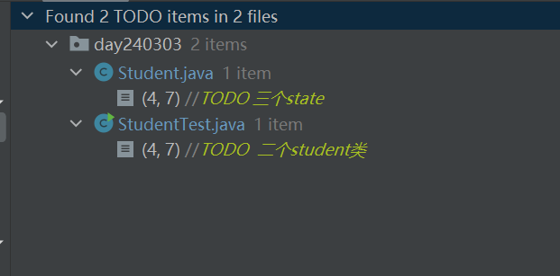
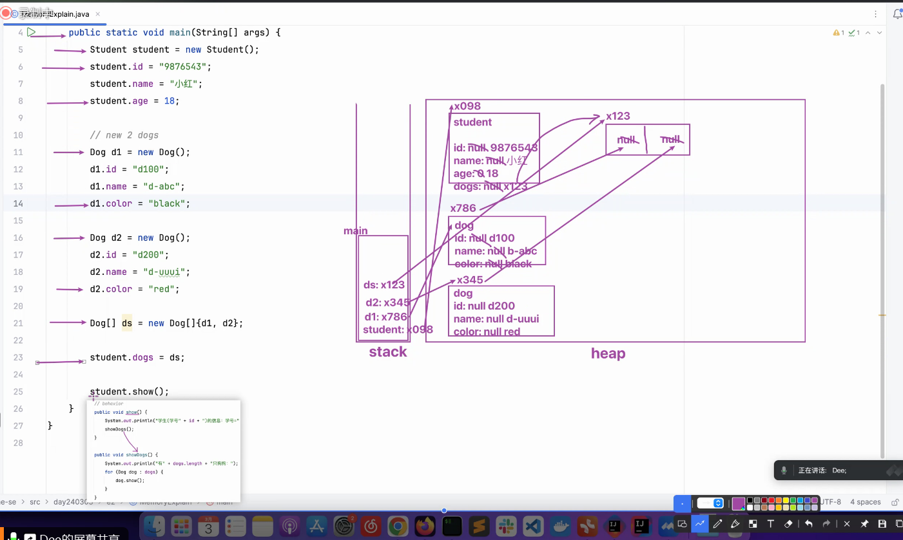
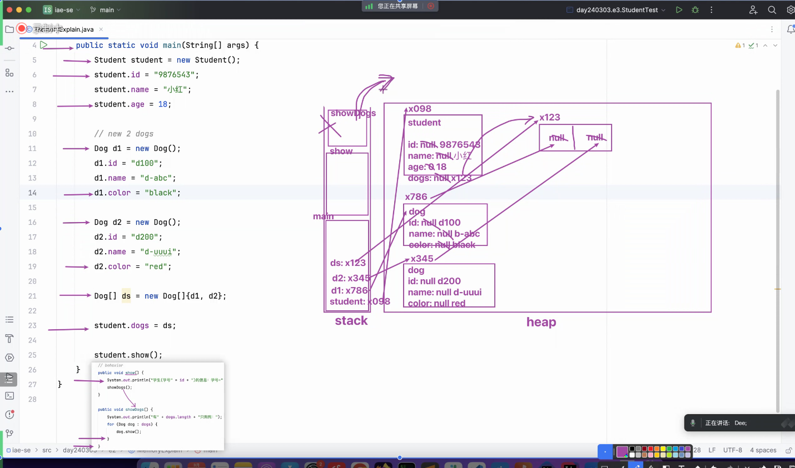
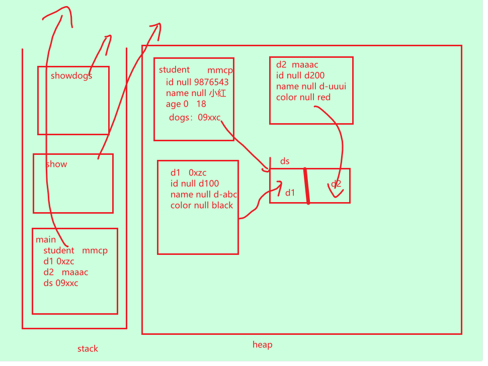
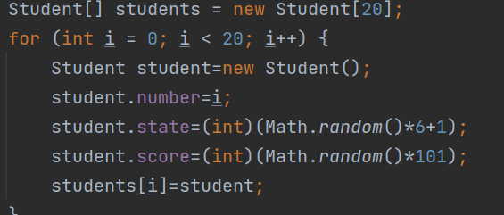

## 一 TODO的使用

## 二  类与对象的学习
完成dogs类（无behavior）

完成Studentwithdogs类，将类融合
##  三 栈堆 
studentwithdogs的栈堆图

栈：先进后出

## 三 student类完成
融合之前的内容（冒泡法，循环）构造20个对象，用for循环加数组进行储存

## 四 overload重载原则
1方法名称相同：重载的方法必须有相同的名称。

2参数列表不同：重载的方法在参数列表上必须有所区别，这可以通过参数的数量、类型或顺序来实现
。
3返回类型可以相同也可以不同：重载方法可以有相同的返回类型，也可以有不同的返回类型。但返回类型并不是重载的必要条件。

4修饰符可以不同：重载的方法可以有不同类型的修饰符，如public、private、protected等。

5抛出异常可以不同：重载的方法可以抛出不同的异常，也可以不抛出异常。