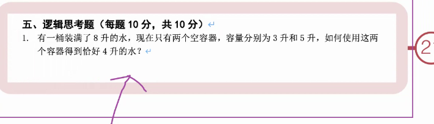

## 单例模式（Singleton）
思路：1构造器私有，如何创建对象：外部不能创建对象

2.类的内部创建对象-->类的哪里

-->state Student  student=new Student();
 出现问题 student不能被调用

解决方法：增加static：属于类，不需要new出对象也可以访问

静态变量：使用 static 关键字定义的类变量，它在内存中只有一个副本，由所有类的对象共享。

静态方法：使用 static 关键字定义的方法可以在不创建对象的情况下被调用。

-->behavior

## final 关键字
一个变量被赋值依次后不允许被修改，就可以用final关键字修饰他

## 访问权限

## 水

正常法

倒水法

