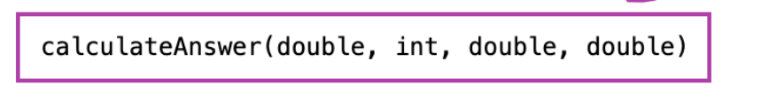

## OOP概念
总体收获：对类和方法的构造更有进一步的理解，理解类的构造，类运行时在栈堆里的
运行。

对象：软件对象（类似现实对象）：拥有state和behavior

state：储存在field（成员变量）里

behavior；通过方法暴露，通过方法进行数据封装

变量（需返回类型）类型：

实例变量（instance variable）（非静态）

类变量（class variable）：静态static,运用所有实例
局部变量（local variable）

参数（const ）：如args[] 始终是变量

变量名：区别大小写，有使用规则

state被behavior包裹在里，behavior可以调动state

class（类）：是创建对象的原型，对真实世界对象的状态和行为进行建模
第一个字母大写，方法名第一个字母动词

方法的声明：六部分
1：修饰符，如public，privta，protect

2返回类型 - 方法返回的值的数据类型，或者 void 如果
方法不返回值，则返回值。

3方法名字：遵循命名原则
  

4.括号里的参数：可以参也可无参，

5.例外列表

6方法主体：body核心

类的建立遵循overload原则
方法签名

new创建对象运算符：使用在对象的建立，从类中调用构造函数

## 方法调方法且无输出
造成无输出

